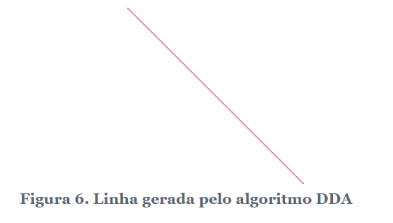

## Análise Diferencial Digital (DDA)
- Algoritmo clássico de rasterização de linhas. Este algoritmo utiliza o algoritmo da retapara gerar pontos de uma linha entre dois pontos ( x 0 , e 0 ) e ( x 1 , e 1 ) , incrementando em pontos fixos.

---


---

- A implementação do algoritmo DDA (disponível no arquivo dda.c ) exige conhecimento prévio de alguns detalhes detalhados da seleção da reta.

Aqui está a organização das suas anotações em um arquivo Markdown (`dda.md`) bem estruturado e pronto para ser usado:

### Implementação do Algoritmo DDA

Este documento descreve a implementação do algoritmo **DDA (Digital Differential Analyzer)** para rasterização de linhas, incluindo comentários sobre o código-fonte, explicações detalhadas, análise do algoritmo e sugestões de exercícios.

---

### Arquivo: `dda.c`

```c
/**
 * \file dda.c
 *
 * \brief Implementação do algoritmo DDA.
 *
 * \author
 * Petrucio Ricardo Tavares de Medeiros  
 * Universidade Federal Rural do Semi-Árido  
 * Departamento de Engenharias e Tecnologia  
 * petrucio at ufersa (ponto) edu (ponto) br
 *
 * \versão 1.0
 * \data abril de 2025
 */

#include <stdio.h>
#include <stdlib.h>  // abs

#define largura 200
#define altura 200

unsigned char imagem[altura][largura][3];

// Função para preencher um pixel na imagem
void putPixel(int x, int y, unsigned char r, unsigned char g, unsigned char b) {
    if ((x >= 0) && (x < largura) && (y >= 0) && (y < altura)) {
        imagem[y][x][0] = r;
        imagem[y][x][1] = g;
        imagem[y][x][2] = b;
    }
}

// Função para limpar a imagem
void clearImage() {
    for (int y = 0; y < altura; y++)
        for (int x = 0; x < largura; x++)
            putPixel(x, y, 255, 255, 255);
}

// Função para salvar a imagem no formato PPM
void saveImage() {
    printf("P3\n%d %d\n255\n", largura, altura);
    for (int y = 0; y < altura; y++) {
        for (int x = 0; x < largura; x++) {
            for (int c = 0; c < 3; c++) {
                printf("%d ", imagem[y][x][c]);
            }
            printf("\n");
        }
    }
}

// Algoritmo DDA
void drawDDA(int x0, int y0, int x1, int y1) {
    int dx = x1 - x0;
    int dy = y1 - y0;

    int steps = abs(dx) > abs(dy) ? abs(dx) : abs(dy);

    float x_inc = (float) dx / steps;
    float y_inc = (float) dy / steps;

    float x = x0;
    float y = y0;

    for (int i = 0; i <= steps; i++) {
        putPixel((int)x, (int)y, 255, 0, 0);
        x += x_inc;
        y += y_inc;
    }
}

int main() {
    clearImage();
    drawDDA(0, 0, 200, 200);
    saveImage();
    return 0;
}
```

---

## 📝 Descrição do Programa

* **Bibliotecas utilizadas:**

  * `stdio.h`: entrada e saída de dados.
  * `stdlib.h`: uso da função `abs()`.

* **Definições globais:**

  ```c
  #define largura 200
  #define altura 200
  unsigned char imagem[altura][largura][3];
  ```

* **Funções auxiliares:**

  * `putPixel`: preenche um pixel na imagem com valores RGB.
  * `clearImage`: preenche toda a imagem com branco.
  * `saveImage`: salva a imagem no formato PPM (tipo P3).

---

## ⚙️ Etapas do Algoritmo DDA

1. Calcular a variação entre os pontos: `dx` e `dy`.
2. Determinar o maior valor entre `abs(dx)` e `abs(dy)` como número de passos.
3. Calcular os incrementos `x_inc` e `y_inc`.
4. Incrementar ponto a ponto até o destino, colorindo com `putPixel`.

---

## Análise do Algoritmo DDA

| Vantagens                      | Desvantagens                                   |
| ------------------------------ | ---------------------------------------------- |
| Simples de implementar         | Utiliza ponto flutuante                        |
| Funciona para qualquer direção | Pode causar acúmulo de erros de arredondamento |

---

1. **Desenho de polígonos:**
   Implemente uma função que receba os vértices de um polígono convexo e gere uma imagem PPM desenhando suas arestas usando o algoritmo DDA.

2. **Renderização 3D:**
   Modifique um código de renderização de modelos 3D para utilizar o algoritmo DDA nas linhas das malhas.

3. **Benchmark:**
   Use a biblioteca `time.h` para comparar o tempo de execução entre o algoritmo DDA e uma implementação que utilize equações específicas para desenhar retas.

---

## ✅ Observações

* A imagem gerada é salva no **formato PPM (P3)**, que pode ser visualizado com softwares como GIMP, IrfanView ou Visualizadores PPM online.
* Os valores de cor são representados por três canais RGB com valores de 0 a 255.

---

> Desenvolvido como exemplo didático para estudo de algoritmos de rasterização de linhas.
